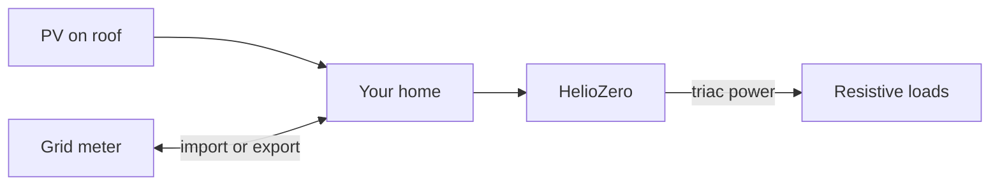

  <a href="https://github.com/TheGrimmChester/HelioZero-ESP32">
    <picture>
      <source media="(prefers-color-scheme: dark)" srcset="assets/brand/helio-zero-logo-dark.svg" />
      
    </picture>
  </a>

  <strong>Route PV surplus to your loads. Hold the incomer near zero.</strong> 
  Divert rooftop excess into resistive loads — water heater, radiators, and more — from an ESP32 on your LAN.

  
  
  
  

  <strong>Documentation (EN/FR):</strong> <a href="https://heliozero.clouded.fr/">heliozero.clouded.fr</a> · source <a href="https://github.com/TheGrimmChester/HelioZero-Website">HelioZero-Website</a>

---

## How it helps you

When your solar panels produce more than the house uses, the extra energy would normally **export through the grid meter**. HelioZero watches **net power at your incomer** and drives a **local resistive load** (usually a water heater) so you **keep more solar at home** instead of giving it away cheaply.

- **Use your own PV** — heat water or other resistive loads when you have surplus
- **Simple setup** — download firmware, join Wi‑Fi, configure from your phone browser (**English & French**)
- **Your metering** — Linky, JSY module, Shelly, Enphase, and more (see below)
- **Optional Home Assistant** — automatic MQTT discovery on your broker

---

## Works with your setup

| You have… | HelioZero source | Notes |
|-----------|------------------|-------|
| French **Linky** smart meter (TIC) | `Linky` | Standard 9600 baud mode required |
| **JSY MK-194T** dual-channel meter | `UxIx2` | House + load channels |
| **JSY MK-333** three-phase meter | `UxIx3` | Modbus on UART |
| **Shelly EM / 3EM** on your LAN | `ShellyEm` | HTTP energy API |
| **Enphase IQ Gateway** | `Enphase` | Consumption reports |
| **Smart Gateways** Wi‑Fi gateway | `SmartG` | P1 gateway, port 82 |
| Custom **voltage + current** front-end | `UxI` | Analog incomer measurement |
| Another **HelioZero** already measuring | `Ext` | Reuse its reading over HTTP |
| Power data on **MQTT** | `Pmqtt` | Subscribe to a JSON topic |

**Not sure which row fits?** See the metering picker in **[Getting started](https://heliozero.clouded.fr/en/getting-started/)** ([FR](https://heliozero.clouded.fr/fr/getting-started/)) on [heliozero.clouded.fr](https://heliozero.clouded.fr/).

Wiring diagrams for every source: **Hardware pinout** section 17 ([EN](https://heliozero.clouded.fr/en/hardware-pinout/) · [FR](https://heliozero.clouded.fr/fr/hardware-pinout/)).

---

## Get started in 3 steps

1. **Download firmware** — [GitHub Releases](https://github.com/TheGrimmChester/HelioZero-ESP32/releases) → `helio-zero-*-wroom32-firmware.bin` (ESP32-WROOM-32 boards).
2. **Follow the install guide** — [EN](https://heliozero.clouded.fr/en/getting-started/) · [FR](https://heliozero.clouded.fr/fr/getting-started/) — flash, Wi‑Fi, wire, verify routing.
3. **Optional: Home Assistant** — [Home Assistant integration pack](https://heliozero.clouded.fr/en/integrations/home-assistant/) (automations, Energy dashboard, cookbooks).

**Building your own hardware?** Start with [DIY hub](https://heliozero.clouded.fr/en/diy/) and [reference build](https://heliozero.clouded.fr/en/reference-build/) ([FR DIY](https://heliozero.clouded.fr/fr/diy/) · [FR reference build](https://heliozero.clouded.fr/fr/reference-build/)).

---

## More guides

| Topic | Document |
|-------|----------|
| Measurement, regulation, MQTT theory | [EN](https://heliozero.clouded.fr/en/user-guide/) · [FR](https://heliozero.clouded.fr/fr/user-guide/) |
| Reference parts list & assembly | [EN](https://heliozero.clouded.fr/en/reference-build/) · [FR](https://heliozero.clouded.fr/fr/reference-build/) |
| GPIO maps & wiring diagrams | [EN](https://heliozero.clouded.fr/en/hardware-pinout/) · [FR](https://heliozero.clouded.fr/fr/hardware-pinout/) |
| Release history & upgrade notes | [Changelog](https://heliozero.clouded.fr/en/changelog/) |

**All documentation:** [heliozero.clouded.fr](https://heliozero.clouded.fr/) (EN/FR) · source [HelioZero-Website](https://github.com/TheGrimmChester/HelioZero-Website). Self-hosted builds may override `SITE_ORIGIN` / firmware `VITE_DOCS_SITE_ORIGIN`.

---

## Developers

Build from source, REST `/api/v1`, OpenAPI, CI, and release process: [EN](https://heliozero.clouded.fr/en/developer/) · [FR](https://heliozero.clouded.fr/fr/developer/)

**Documentation** is published at [heliozero.clouded.fr](https://heliozero.clouded.fr/) from [HelioZero-Website](https://github.com/TheGrimmChester/HelioZero-Website). Field-help markdown is generated from this repo: `cd web && npx tsx scripts/generate-field-help-docs.ts` (see [CONTRIBUTING.md](CONTRIBUTING.md)). Local CI-parity: `./scripts/run_all_firmware_checks.sh`.

---

## License and safety

This project is **EUPL-1.2** — see [`LICENSE`](LICENSE) and the header in [`firmware/HelioZero.ino`](firmware/HelioZero.ino).

**Mains wiring is your responsibility.** This project interfaces with **line voltage**; follow local rules, use qualified help where required, and respect meter / Linky interface limits in the [user guide](https://heliozero.clouded.fr/en/user-guide/) and [pinout](https://heliozero.clouded.fr/en/hardware-pinout/).

On your home LAN the web UI is **open by default** — set an **HTTP API password** in Settings before you trust the network. **Do not** expose port 80 to the internet without TLS and a proper front door.
